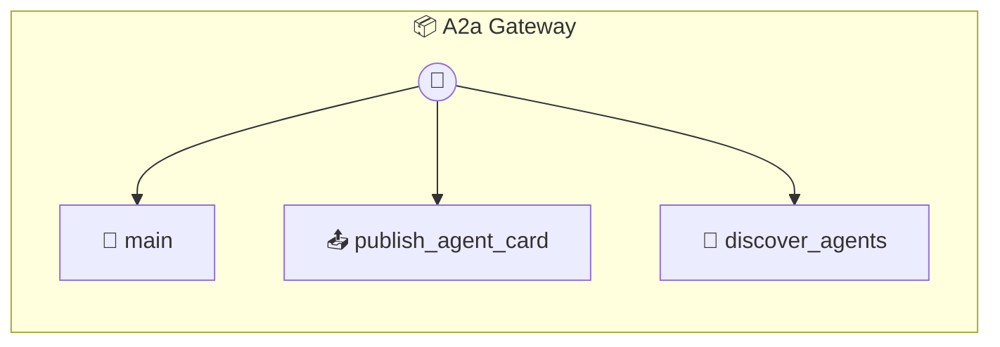

# A2a Gateway

A2A Gateway (Google A2A Standard) Provides a networking layer for AI agents to discover each other. Manages "Agent Cards" (Digital Business Cards) for local agents.

> **3 tools** · API Photon · v1.0.0 · MIT

**Platform Features:** `custom-ui` `dashboard`

## ⚙️ Configuration

No configuration required.


## 🔧 Tools


### `main`

Main entry point for the A2A Dashboard.


---


### `publish_agent_card`

Create and publish an A2A Agent Card.


| Parameter | Type | Required | Description |
|-----------|------|----------|-------------|
| `name` | string | Yes | Agent's display name |
| `role` | string | Yes | Primary function (e.g. "Legal Assistant", "Tutor") |
| `skills` | string[] | Yes | List of capabilities |
| `peerId` | string | Yes | WebRTC Peer ID for direct A2A communication |


---


### `discover_agents`

Search for remote agents using A2A semantic discovery. Host AI: Use this to find specialized "Remote Agents" to collaborate with.


| Parameter | Type | Required | Description |
|-----------|------|----------|-------------|
| `query` | string | Yes | Search query (e.g. "expert in Rust and A2A") |


---


## 🏗️ Architecture




## 📥 Usage

```bash
# Install from marketplace
photon add a2a-gateway

# Get MCP config for your client
photon info a2a-gateway --mcp
```

## 📦 Dependencies

No external dependencies.

---

MIT · v1.0.0 · Portel
