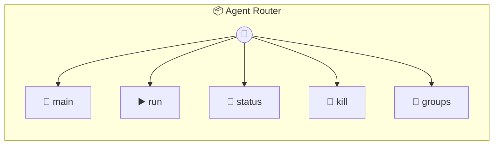

# Agent Router

Agent Router — smart proxy that delegates to the right runner. Implements the same run() interface as individual runners. Routes based on the explicit `agent` parameter, or auto-classifies the prompt when autoClassify is enabled. Falls back to defaultAgent when no agent is specified and autoClassify is off.

> **5 tools** · API Photon · v1.0.0 · MIT

**Platform Features:** `custom-ui` `stateful` `dashboard`

## ⚙️ Configuration


| Variable | Required | Type | Description |
|----------|----------|------|-------------|
| `AGENT_ROUTER_CLAUDE` | Yes | any | No description available |
| `AGENT_ROUTER_GEMINI` | Yes | any | No description available |
| `AGENT_ROUTER_AIDER` | Yes | any | No description available |
| `AGENT_ROUTER_OPENCODE` | Yes | any | No description available |


## 🔧 Tools


### `main`

Agent Router Dashboard


---


### `run`

Route a prompt to the appropriate agent runner. Uses the explicit `agent` param, auto-classifies if enabled, or falls back to the defaultAgent setting.


| Parameter | Type | Required | Description |
|-----------|------|----------|-------------|
| `groupFolder` | string | Yes | Group folder name (e.g. `"dev-team"`) |
| `prompt` | string | Yes | The prompt to route (e.g. `"Refactor the auth module"`) |
| `agent` | string | No | Explicit agent ('claude'|'gemini'|'aider'|'opencode'|'auto') (e.g. `"claude"`) |
| `chatJid` | string | No | Chat JID for result routing (passed through) |
| `sessionId` | string | No | Session ID for conversation continuity (Claude only) |
| `systemPrompt` | string | No | Optional system context |
| `addDirs` | string[] | No | Additional directories to expose |


---


### `status`

Aggregate status from all runners.


---


### `kill`

Kill a running agent — tries each runner until the group is found.


| Parameter | Type | Required | Description |
|-----------|------|----------|-------------|
| `groupFolder` | string | Yes | Group folder to kill |


---


### `groups`

Union of all runners' group folders (deduped by folder name).


---


## 🏗️ Architecture




## 📥 Usage

```bash
# Install from marketplace
photon add agent-router

# Get MCP config for your client
photon info agent-router --mcp
```

## 📦 Dependencies

No external dependencies.

---

MIT · v1.0.0
