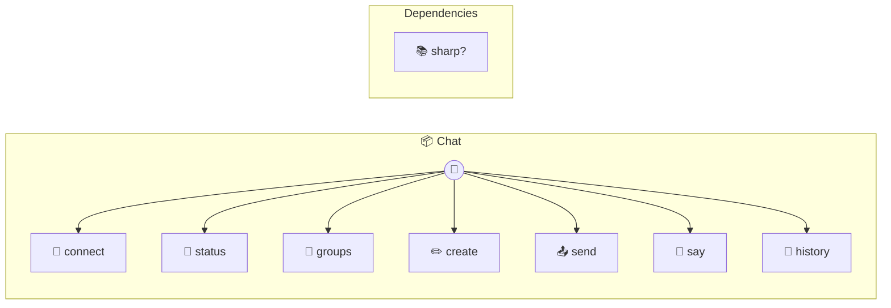

# Chat

Chat — browser-based messaging channel for testing claw pipelines. Wire-compatible with WhatsApp/Telegram channel interface. Groups stored as nested object — single instance per tenant.

> **7 tools** · API Photon · v1.0.0 · MIT

**Platform Features:** `custom-ui` `stateful` `channels`

## ⚙️ Configuration

No configuration required.


## 📋 Quick Reference

| Method | Description |
|--------|-------------|
| `connect` | - |
| `status` | - |
| `groups` | - |
| `create` | - |
| `send` | - |
| `say` | Inject a user message — fires to claw subscribers. |
| `history` | - |


## 🔧 Tools


### `connect`

No description available


---


### `status`

No description available


---


### `groups`

No description available


---


### `create`

No description available


---


### `send`

No description available


---


### `say`

Inject a user message — fires to claw subscribers.


| Parameter | Type | Required | Description |
|-----------|------|----------|-------------|
| `chat` | string | Yes | Group name or ID |
| `text` | string | Yes | Message text |
| `sender` | string | No | Sender name {@default "User"} |
| `attachments` | string[] | No | File paths (images, PDFs, text files — max 5) |


---


### `history`

No description available


---


## 🏗️ Architecture




## 📥 Usage

```bash
# Install from marketplace
photon add chat

# Get MCP config for your client
photon info chat --mcp
```

## 📦 Dependencies


```
sharp?
```

---

MIT · v1.0.0
