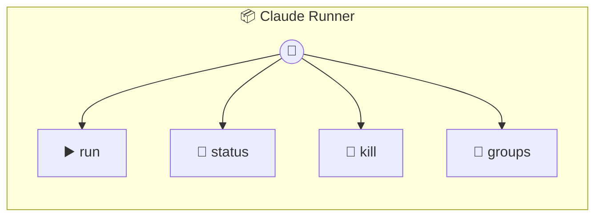

# Claude Runner

Claude Runner — executes Claude agents locally per group folder. Each group gets an isolated working directory with its own CLAUDE.md for persistent memory. Spawns `claude -p` as a subprocess with the group folder as cwd. Manages concurrency so multiple groups don't overwhelm the system. Includes conversation memory injection for groups without a live session.

> **4 tools** · API Photon · v1.0.0 · MIT

**Platform Features:** `stateful`

## ⚙️ Configuration

No configuration required.


## 🔧 Tools


### `run`

Run a prompt against a group's context using Claude. Returns the agent's text response.


| Parameter | Type | Required | Description |
|-----------|------|----------|-------------|
| `groupFolder` | string | Yes | Group folder name (e.g. `"dev-team"`) |
| `prompt` | string | Yes | The prompt to send to Claude (e.g. `"Summarise the discussion"`) |
| `chatJid` | string | No | Chat JID for result routing (passed through in events) |
| `sessionId` | string | No | Optional session ID for conversation continuity |
| `systemPrompt` | string | No | Optional extra system context prepended to the group's CLAUDE.md |
| `addDirs` | string[] | No | Additional directories Claude can access (e.g. media download dirs) |
| `agent` | string | No | Agent name (ignored — satisfies router contract) |


---


### `status`

Check what's currently running and queued.


---


### `kill`

Kill a running agent for a group.


| Parameter | Type | Required | Description |
|-----------|------|----------|-------------|
| `groupFolder` | string | Yes | Group folder to kill |


---


### `groups`

List all group folders with their CLAUDE.md content summary.


---


## 🏗️ Architecture




## 📥 Usage

```bash
# Install from marketplace
photon add claude-runner

# Get MCP config for your client
photon info claude-runner --mcp
```

## 📦 Dependencies

No external dependencies.

---

MIT · v1.0.0
