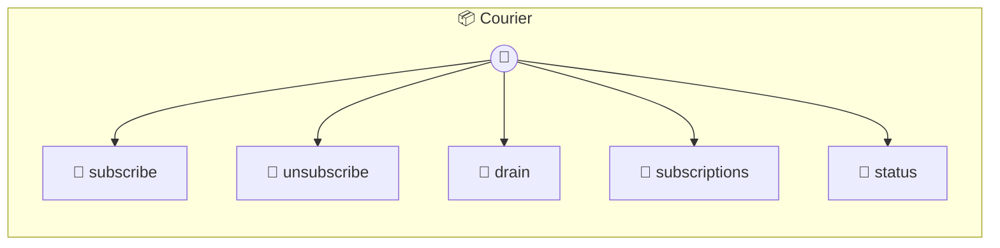

# Courier

Max inbox age before cleanup (7 days)

> **5 tools** · API Photon · v1.0.0 · MIT

**Platform Features:** `stateful` `channels`

## ⚙️ Configuration

No configuration required.


## 🔧 Tools


### `subscribe`

Subscribe to a channel with durable delivery. Messages are persisted to a disk-backed inbox. With a schedule, they're delivered in batches at clock-aligned times. Without a schedule, they're delivered immediately but still persisted — use drain() after restart to catch up on missed messages. The subscription key is derived from channel + group automatically.


| Parameter | Type | Required | Description |
|-----------|------|----------|-------------|
| `channel` | any | Yes | Channel name [choice: telegram, whatsapp] |
| `group` | string | Yes | Group name or chat ID |
| `schedule` | string | No | Delivery schedule (omit for real-time) [choice: @5m, @15m, @30m, @hourly, @daily] |
| `trigger` | string | No | Trigger substring filter |
| `ack` | string | No | Auto-acknowledgment message for scheduled groups (use {time} for next delivery time) |
| `handler` | (messages: InboxEntry[] | No | Callback for message delivery |


---


### `unsubscribe`

Remove a subscription and stop scheduled delivery.


| Parameter | Type | Required | Description |
|-----------|------|----------|-------------|
| `channel` | string | Yes | Channel name [choice: telegram, whatsapp] |
| `group` | string | Yes | Group name or chat ID |


---


### `drain`

Read pending messages for a group without waiting for the schedule. Advances the cursor — messages won't be delivered again.


| Parameter | Type | Required | Description |
|-----------|------|----------|-------------|
| `channel` | string | Yes | Channel name [choice: telegram, whatsapp] |
| `group` | string | Yes | Group name or chat ID |


---


### `subscriptions`

List active subscriptions and their status.


---


### `status`

Courier status overview.


---


## 🏗️ Architecture




## 📥 Usage

```bash
# Install from marketplace
photon add courier

# Get MCP config for your client
photon info courier --mcp
```

## 📦 Dependencies

No external dependencies.

---

MIT · v1.0.0
