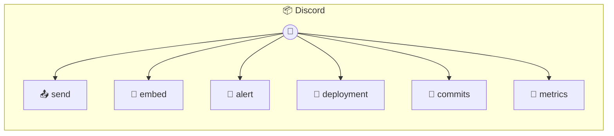

# Discord

Send messages and manage Discord via webhooks Like n8n's Discord node - notifications, alerts, and automation Perfect for: - Alert notifications - Build/deploy notifications - Automated reports - Team notifications

> **6 tools** · API Photon · v1.18.0 · MIT


## ⚙️ Configuration


| Variable | Required | Type | Description |
|----------|----------|------|-------------|
| `DISCORD_WEBHOOKURL` | Yes | string | No description available |


## 📋 Quick Reference

| Method | Description |
|--------|-------------|
| `send` | Send a simple text message |
| `embed` | Send a rich embed message |
| `alert` | Send an alert notification (pre-styled embed) |
| `deployment` | Send a deployment notification |
| `commits` | Send a GitHub-style commit notification |
| `metrics` | Send a monitoring/metrics notification |


## 🔧 Tools


### `send`

Send a simple text message


| Parameter | Type | Required | Description |
|-----------|------|----------|-------------|
| `content` | string | Yes | Message content (max 2000 chars) |
| `username` | string | No | Override the webhook's default username |
| `avatarUrl` | string | No | Override the webhook's default avatar |


---


### `embed`

Send a rich embed message


| Parameter | Type | Required | Description |
|-----------|------|----------|-------------|
| `title` | string | No | Embed title |
| `description` | string | No | Embed description |
| `color` | string | number | No | Color as hex string (e.g., "#FF0000") or decimal |
| `fields` | Array<{ name: string | No | Array of {name, value, inline} objects |
| `footer` | any | Yes | Footer text |
| `thumbnail` | any | Yes | Thumbnail URL |
| `image` | any | Yes | Image URL |
| `url` | any | Yes | URL to link the title to |


---


### `alert`

Send an alert notification (pre-styled embed)


| Parameter | Type | Required | Description |
|-----------|------|----------|-------------|
| `level` | 'info' | 'success' | 'warning' | 'error' | Yes | Alert level: info, success, warning, error |
| `title` | string | Yes | Alert title |
| `message` | string | Yes | Alert message |
| `details` | string | No | Optional additional details |


---


### `deployment`

Send a deployment notification


| Parameter | Type | Required | Description |
|-----------|------|----------|-------------|
| `app` | string | Yes | Application name |
| `version` | string | Yes | Version deployed |
| `environment` | 'production' | 'staging' | 'development' | Yes | Deployment environment |
| `status` | 'started' | 'success' | 'failed' | Yes | Deployment status |
| `url` | string | No | Optional URL to the deployment |
| `author` | string | No | Who triggered the deployment |


---


### `commits`

Send a GitHub-style commit notification


| Parameter | Type | Required | Description |
|-----------|------|----------|-------------|
| `repo` | string | Yes | Repository name |
| `branch` | string | Yes | Branch name |
| `commits` | Array<{ message: string | Yes | Array of {message, author, sha, url} |
| `compareUrl` | any | Yes | URL to compare changes |


---


### `metrics`

Send a monitoring/metrics notification


| Parameter | Type | Required | Description |
|-----------|------|----------|-------------|
| `title` | string | Yes | Metric title |
| `metrics` | Array<{ label: string | Yes | Array of {label, value, unit} objects |
| `status` | any | Yes | Overall status |


---


## 🏗️ Architecture




## 📥 Usage

```bash
# Install from marketplace
photon add discord

# Get MCP config for your client
photon info discord --mcp
```

## 📦 Dependencies

No external dependencies.

---

MIT · v1.18.0
