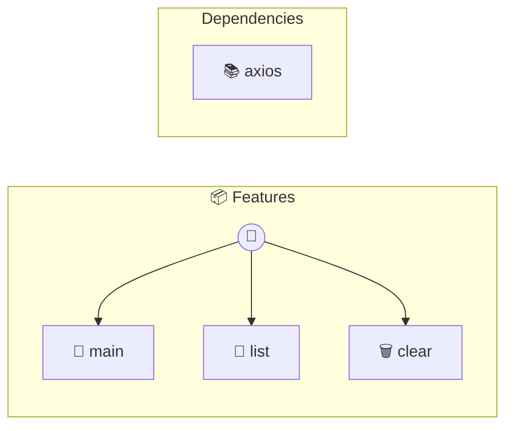

# Features

Photon Features Intent as metadata — one tag, automatic behavior. Each slide presents a capability. Each method proves it works.

> **3 tools** · API Photon · v1.0.0 · MIT

**Platform Features:** `stateful` `webhooks`

## ⚙️ Configuration

No configuration required.


## 🔧 Tools


### `main`

Photon: Intent as Metadata


---


### `list`

No description available


---


### `clear`

No description available


---


## 🏗️ Architecture




## 📥 Usage

```bash
# Install from marketplace
photon add features

# Get MCP config for your client
photon info features --mcp
```

## 📦 Dependencies


```
axios@^1.0.0
```

---

MIT · v1.0.0
