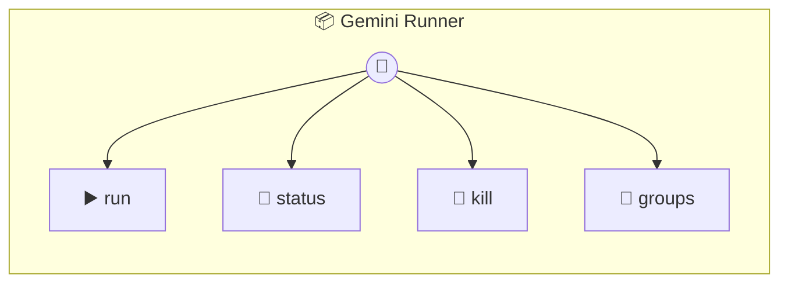

# Gemini Runner

Gemini Runner — executes Gemini CLI agents locally per group folder. Spawns `gemini -p` as a subprocess with the group folder as cwd. Injects conversation memory from previous runs since Gemini CLI has no native session continuity. Manages concurrency so multiple groups don't overwhelm the system.

> **4 tools** · API Photon · v1.0.0 · MIT

**Platform Features:** `stateful`

## ⚙️ Configuration

No configuration required.


## 🔧 Tools


### `run`

Run a prompt against a group's context using Gemini CLI. Returns the agent's text response.


| Parameter | Type | Required | Description |
|-----------|------|----------|-------------|
| `groupFolder` | string | Yes | Group folder name (e.g. `"dev-team"`) |
| `prompt` | string | Yes | The prompt to send to Gemini (e.g. `"Summarise the discussion"`) |
| `chatJid` | string | No | Chat JID for result routing (passed through in events) |
| `systemPrompt` | string | No | Optional system context prepended to the prompt |
| `agent` | string | No | Agent name (ignored — satisfies router contract) |


---


### `status`

Check what's currently running and queued.


---


### `kill`

Kill a running agent for a group.


| Parameter | Type | Required | Description |
|-----------|------|----------|-------------|
| `groupFolder` | string | Yes | Group folder to kill |


---


### `groups`

List all group folders managed by this runner.


---


## 🏗️ Architecture




## 📥 Usage

```bash
# Install from marketplace
photon add gemini-runner

# Get MCP config for your client
photon info gemini-runner --mcp
```

## 📦 Dependencies

No external dependencies.

---

MIT · v1.0.0
