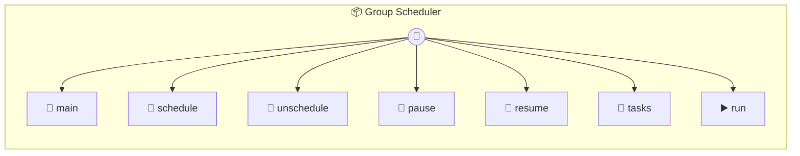

# Group Scheduler

Group Scheduler — dynamic scheduled tasks for WhatsApp groups. Each task runs a prompt against a group context on a cron schedule. When a task fires, it emits { type: 'task:fire' } — the agent runner (e.g. nanoclaw's container-runner) handles execution. Uses this.schedule for runtime-managed cron execution and this.memory to persist task definitions.

> **7 tools** · API Photon · v1.0.0 · MIT

**Platform Features:** `custom-ui` `stateful` `dashboard`

## ⚙️ Configuration

No configuration required.


## 📋 Quick Reference

| Method | Description |
|--------|-------------|
| `main` | Group Scheduler Dashboard |
| `schedule` | Create a new scheduled task for a group. |
| `unschedule` | Cancel and remove a scheduled task. |
| `pause` | Pause a task without removing it. |
| `resume` | Resume a paused task. |
| `tasks` | List all scheduled tasks, optionally filtered by group folder. |
| `run` | Manually trigger a task immediately, outside its normal schedule. |


## 🔧 Tools


### `main`

Group Scheduler Dashboard


---


### `schedule`

Create a new scheduled task for a group.


| Parameter | Type | Required | Description |
|-----------|------|----------|-------------|
| `groupFolder` | string | Yes | Filesystem folder name for the group (e.g. `"dev-team"`) |
| `chatJid` | string | Yes | WhatsApp JID of the chat (e.g. `"123@g.us"`) |
| `prompt` | string | Yes | The prompt to run when the task fires (e.g. `"Summarise today's activity"`) |
| `cron` | string | Yes | Cron expression or shorthand (e.g. '@daily', '0 9 * * 1-5') (e.g. `"0 9 * * *"`) |
| `contextMode` | 'group' | 'isolated' | No | Whether to run with full group context or isolated (e.g. `"group"`) |
| `name` | string | No | Optional name for the task |


---


### `unschedule`

Cancel and remove a scheduled task.


| Parameter | Type | Required | Description |
|-----------|------|----------|-------------|
| `taskId` | string | Yes | Task ID to cancel |


---


### `pause`

Pause a task without removing it.


| Parameter | Type | Required | Description |
|-----------|------|----------|-------------|
| `taskId` | string | Yes | Task ID to pause |


---


### `resume`

Resume a paused task.


| Parameter | Type | Required | Description |
|-----------|------|----------|-------------|
| `taskId` | string | Yes | Task ID to resume |


---


### `tasks`

List all scheduled tasks, optionally filtered by group folder.


| Parameter | Type | Required | Description |
|-----------|------|----------|-------------|
| `groupFolder` | string | No | Optional filter by group folder |


---


### `run`

Manually trigger a task immediately, outside its normal schedule.


| Parameter | Type | Required | Description |
|-----------|------|----------|-------------|
| `taskId` | string | Yes | Task ID to fire now |


---


## 🏗️ Architecture




## 📥 Usage

```bash
# Install from marketplace
photon add group-scheduler

# Get MCP config for your client
photon info group-scheduler --mcp
```

## 📦 Dependencies

No external dependencies.

---

MIT · v1.0.0
