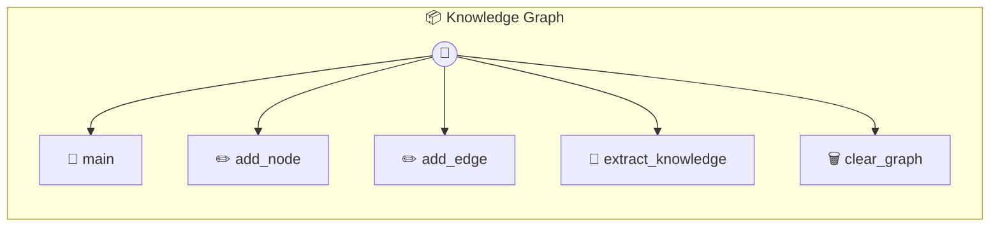

# Knowledge Graph

P2P Knowledge Graph — Shared Research & Discovery Build and collaborate on a semantic knowledge graph. Features: Local graph storage, P2P sync, and AI-powered concept extraction.

> **5 tools** · API Photon · v1.0.0 · MIT

**Platform Features:** `custom-ui`

## ⚙️ Configuration


| Variable | Required | Type | Description |
|----------|----------|------|-------------|
| `KNOWLEDGE_GRAPH_CLAUDE` | Yes | any | No description available |


## 🔧 Tools


### `main`

Main entry point for the Graph UI


---


### `add_node`

Add a new concept/node to the graph.


---


### `add_edge`

Create a relationship between two nodes.


---


### `extract_knowledge`

Use AI to extract knowledge (nodes & edges) from raw text.


| Parameter | Type | Required | Description |
|-----------|------|----------|-------------|
| `text` | string | Yes | Raw research notes or text |


---


### `clear_graph`

Clear the current graph.


---


## 🏗️ Architecture




## 📥 Usage

```bash
# Install from marketplace
photon add knowledge-graph

# Get MCP config for your client
photon info knowledge-graph --mcp
```

## 📦 Dependencies

No external dependencies.

---

MIT · v1.0.0 · Portel
