# LG Remote

Control LG WebOS TVs Provides comprehensive control of LG WebOS Smart TVs via network. Supports discovery, pairing, media control, app management, and more. Uses SSAP (Smart Service Access Protocol) over WebSocket. Common use cases: - Discovery: "Find LG TVs on my network" - Control: "Turn off the TV", "Set volume to 50" - Media: "Play/pause the current content" - Apps: "Launch Netflix", "Show running apps" Example: discover() then connect({ ip: "192.168.1.100" }) Configuration: - credentials_file: Path to store TV credentials (optional, default: "lg-tv-credentials.json") Dependencies are auto-installed on first run.

> **27 tools** · API Photon · v1.1.0 · MIT

**Platform Features:** `stateful`

## ⚙️ Configuration


| Variable | Required | Type | Description |
|----------|----------|------|-------------|
| `L_G_REMOTE_CREDENTIALS_FILE` | No | string | Path to store TV credentials (optional, default: "lg-tv-credentials.json") |


### Setup Instructions

- credentials_file: Path to store TV credentials (optional, default: "lg-tv-credentials.json")
Dependencies are auto-installed on first run.


## 📋 Quick Reference

| Method | Description |
|--------|-------------|
| `discover` | Discover LG TVs on the network using SSDP |
| `connect` | Connect to an LG TV |
| `pair` | Complete pairing after TV prompt |
| `disconnect` | Disconnect from the current TV |
| `list` | List discovered and saved TVs |
| `forget` | Delete saved credentials for a TV |
| `status` | Get current connection status |
| `volume` | Get/set volume level |
| `mute` | Toggle mute |
| `setMac` | Set MAC address for a saved TV (for Wake-on-LAN) |
| `on` | Turn TV on using Wake-on-LAN |
| `off` | Turn TV off |
| `notify` | Show a notification toast on TV |
| `app` | Get current app or launch an app |
| `apps` | List all installed apps |
| `channel` | Get current channel or switch to a channel |
| `channels` | List all available channels |
| `input` | Switch to an input |
| `inputs` | List all available inputs |
| `play` | Play media |
| `pause` | Pause media |
| `stop` | Stop media |
| `rewind` | Rewind media |
| `forward` | Fast forward media |
| `button` | Send remote button press or list supported buttons |
| `systemInfo` | Get TV system information (model, firmware, etc.) |
| `softwareInfo` | Get current software/firmware information |


## 🔧 Tools


### `discover`

Discover LG TVs on the network using SSDP


| Parameter | Type | Required | Description |
|-----------|------|----------|-------------|
| `timeout` | any | No | Discovery timeout in seconds |


---


### `connect`

Connect to an LG TV


| Parameter | Type | Required | Description |
|-----------|------|----------|-------------|
| `ip` | any | Yes | TV IP address (optional, uses auto-discovered default TV if not specified) |
| `secure` | boolean } | No | Use secure WebSocket (wss://) |


---


### `pair`

Complete pairing after TV prompt


| Parameter | Type | Required | Description |
|-----------|------|----------|-------------|
| `pin` | any | Yes | The 6-digit PIN shown on TV (required for new pairing) |
| `name` | string } | No | Optional name for the TV |


---


### `disconnect`

Disconnect from the current TV


---


### `list`

List discovered and saved TVs


| Parameter | Type | Required | Description |
|-----------|------|----------|-------------|
| `refresh` | any | No | If true, re-discover TVs on network |


---


### `forget`

Delete saved credentials for a TV


| Parameter | Type | Required | Description |
|-----------|------|----------|-------------|
| `ip` | string | Yes | TV IP address |


---


### `status`

Get current connection status


---


### `volume`

Get/set volume level


| Parameter | Type | Required | Description |
|-----------|------|----------|-------------|
| `level` | any | Yes | Volume level (0-100), "+N" to increase by N, "-N" to decrease by N, or omit to get current |


---


### `mute`

Toggle mute


| Parameter | Type | Required | Description |
|-----------|------|----------|-------------|
| `mute` | any | Yes | True to mute, false to unmute (optional - omit to toggle) |


---


### `setMac`

Set MAC address for a saved TV (for Wake-on-LAN)


| Parameter | Type | Required | Description |
|-----------|------|----------|-------------|
| `ip` | string | Yes | TV IP address |
| `mac` | string | Yes | TV MAC address (format: AA:BB:CC:DD:EE:FF) |


---


### `on`

Turn TV on using Wake-on-LAN


| Parameter | Type | Required | Description |
|-----------|------|----------|-------------|
| `mac` | any | Yes | TV's MAC address (optional if already saved) |
| `ip` | string } | string | No | TV's IP address (optional if already saved) |


---


### `off`

Turn TV off


---


### `notify`

Show a notification toast on TV


| Parameter | Type | Required | Description |
|-----------|------|----------|-------------|
| `message` | string | Yes | Notification message |


---


### `app`

Get current app or launch an app


| Parameter | Type | Required | Description |
|-----------|------|----------|-------------|
| `id` | any | Yes | App ID or title to launch (e.g., "netflix", "YouTube"), or omit to get current |


---


### `apps`

List all installed apps


---


### `channel`

Get current channel or switch to a channel


| Parameter | Type | Required | Description |
|-----------|------|----------|-------------|
| `number` | any | Yes | Channel number to switch to, "+1" for next, "-1" for previous, or omit to get current |


---


### `channels`

List all available channels


---


### `input`

Switch to an input


| Parameter | Type | Required | Description |
|-----------|------|----------|-------------|
| `id` | string | Yes | Input ID to switch to (e.g., "HDMI_1", "HDMI_2") |


---


### `inputs`

List all available inputs


---


### `play`

Play media


---


### `pause`

Pause media


---


### `stop`

Stop media


---


### `rewind`

Rewind media


---


### `forward`

Fast forward media


---


### `button`

Send remote button press or list supported buttons


| Parameter | Type | Required | Description |
|-----------|------|----------|-------------|
| `button` | any | Yes | Button name (omit or use 'all' to list all supported buttons)
   *
   * Navigation: HOME, BACK, EXIT, UP, DOWN, LEFT, RIGHT, ENTER, CLICK
   * Colors: RED, GREEN, YELLOW, BLUE
   * Channel: CHANNEL_UP, CHANNEL_DOWN
   * Volume: VOLUME_UP, VOLUME_DOWN
   * Media: PLAY, PAUSE, STOP, REWIND, FAST_FORWARD
   * Other: ASTERISK |


---


### `systemInfo`

Get TV system information (model, firmware, etc.)


---


### `softwareInfo`

Get current software/firmware information


---


## 🏗️ Architecture

```mermaid
flowchart LR
    subgraph lg_remote["📦 Lg Remote"]
        direction TB
        PHOTON((🎯))
        T0[🔧 discover]
        PHOTON --> T0
        T1[🔌 connect]
        PHOTON --> T1
        T2[🔧 pair]
        PHOTON --> T2
        T3[🔧 disconnect]
        PHOTON --> T3
        T4[📖 list]
        PHOTON --> T4
        T5[🔧 forget]
        PHOTON --> T5
        T6[🔧 status]
        PHOTON --> T6
        T7[🔧 volume]
        PHOTON --> T7
        T8[🔧 mute]
        PHOTON --> T8
        T9[✏️ setMac]
        PHOTON --> T9
        T10[🔧 on]
        PHOTON --> T10
        T11[🔧 off]
        PHOTON --> T11
        T12[📤 notify]
        PHOTON --> T12
        T13[🔧 app]
        PHOTON --> T13
        T14[🔧 apps]
        PHOTON --> T14
        T15[🔧 channel]
        PHOTON --> T15
        T16[🔧 channels]
        PHOTON --> T16
        T17[🔧 input]
        PHOTON --> T17
        T18[🔧 inputs]
        PHOTON --> T18
        T19[🔧 play]
        PHOTON --> T19
        T20[🔧 pause]
        PHOTON --> T20
        T21[⏹️ stop]
        PHOTON --> T21
        T22[🔧 rewind]
        PHOTON --> T22
        T23[🔧 forward]
        PHOTON --> T23
        T24[🔧 button]
        PHOTON --> T24
        T25[🔧 systemInfo]
        PHOTON --> T25
        T26[🔧 softwareInfo]
        PHOTON --> T26
    end

    subgraph deps["Dependencies"]
        direction TB
        NPM0[📚 ws]
        NPM1[📚 wake_on_lan]
    end
```




## 📥 Usage

```bash
# Install from marketplace
photon add lg-remote

# Get MCP config for your client
photon info lg-remote --mcp
```

## 📦 Dependencies


```
ws@^8.18.0, wake_on_lan@^1.0.0
```

---

MIT · v1.1.0 · Photon (based on pokemote by mithileshchellappan)
