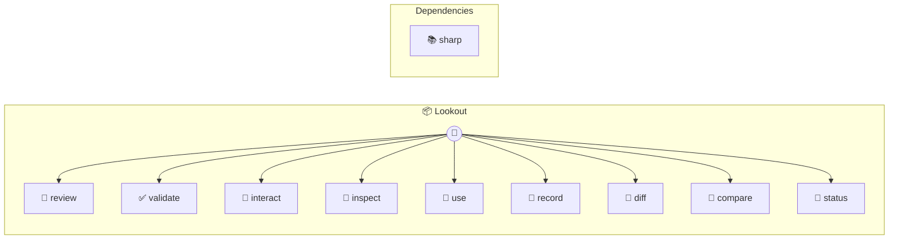

# Lookout

Lookout — Local AI UI Inspector Sees your UI, finds issues, validates promises, and tests interactions. Runs Qwen3-VL locally on Apple Silicon via MLX — zero API cost, fully offline.

> **9 tools** · API Photon · v1.0.0 · MIT

**Platform Features:** `custom-ui` `stateful`

## ⚙️ Configuration

No configuration required.


## 📋 Quick Reference

| Method | Description |
|--------|-------------|
| `review` | Review a screenshot for UI/UX issues |
| `validate` | Validate a screenshot against a list of promises |
| `interact` | Test a UI interaction and verify the result |
| `inspect` | Inspect a macOS surface via Peekaboo and return its screenshot path and element map |
| `use` | Use a macOS app toward a goal by planning Peekaboo actions step-by-step |
| `record` | Record a page, capture frames, generate diff trail, and analyze with AI |
| `diff` | Generate visual diff from a sequence of screenshots |
| `compare` | Compare two screenshots (before/after) |
| `status` | Check if the MLX model is available and working |


## 🔧 Tools


### `review`

Review a screenshot for UI/UX issues


| Parameter | Type | Required | Description |
|-----------|------|----------|-------------|
| `image` | any | Yes | Path to screenshot file |
| `prompt` | string } | No | Optional custom analysis prompt |


---


### `validate`

Validate a screenshot against a list of promises


| Parameter | Type | Required | Description |
|-----------|------|----------|-------------|
| `image` | any | Yes | Path to screenshot file |
| `promises` | string[] } | Yes | Array of promise strings to check (e.g., ["Drag thumbnails to reorder slides", "Theme selector dropdown"]) |


---


### `interact`

Test a UI interaction and verify the result


| Parameter | Type | Required | Description |
|-----------|------|----------|-------------|
| `url` | any | Yes | Page URL to open |
| `action` | string | Yes | What to do in plain English (e.g., "click the theme dropdown and select gaia") |
| `expect` | string } | Yes | What should happen (e.g., "slide styling changes to gaia theme") |


---


### `inspect`

Inspect a macOS surface via Peekaboo and return its screenshot path and element map


| Parameter | Type | Required | Description |
|-----------|------|----------|-------------|
| `app` | any | Yes | Optional application name to target (e.g. "Safari") |
| `mode` | 'screen' | 'window' | 'frontmost' | No | Capture mode {@default frontmost} |
| `path` | string | No | Optional output screenshot path |
| `screenIndex` | number | No | Optional screen index for screen capture |


---


### `use`

Use a macOS app toward a goal by planning Peekaboo actions step-by-step


| Parameter | Type | Required | Description |
|-----------|------|----------|-------------|
| `goal` | any | Yes | What you want to accomplish in plain English |
| `app` | string | No | Optional application name to target (e.g. "Safari") |
| `url` | string | No | Optional URL or file to open before starting |
| `maxSteps` | number | No | Max planning/execution steps {@default 5} |
| `mode` | 'screen' | 'window' | 'frontmost' | No | Capture mode {@default frontmost} |
| `screenIndex` | number | No | Optional screen index for screen capture |


---


### `record`

Record a page, capture frames, generate diff trail, and analyze with AI


| Parameter | Type | Required | Description |
|-----------|------|----------|-------------|
| `url` | any | Yes | Page URL to record |
| `duration` | number | No | Recording duration in seconds {@default 3} |
| `fps` | number | No | Frames per second to capture {@default 4} |
| `action` | string | No | Optional action to perform before recording (e.g., "click the next slide button") |
| `query` | string | No | Optional question to ask AI about the recorded sequence (e.g., "was the transition smooth?") |
| `mode` | 'trail' | 'heatmap' | No | Diff visualization: trail or heatmap {@default trail} |


---


### `diff`

Generate visual diff from a sequence of screenshots


| Parameter | Type | Required | Description |
|-----------|------|----------|-------------|
| `images` | any | Yes | Array of image paths in chronological order (min 2) |
| `output` | string | Yes | Path to save the result image |
| `mode` | 'trail' | 'heatmap' | 'blink' | No | Visualization mode: trail (motion path with color gradient), heatmap (change intensity), or blink (animated GIF alternating frames) {@default trail} |
| `threshold` | number | No | Pixel difference threshold (0-255) to count as changed {@default 30} |


---


### `compare`

Compare two screenshots (before/after)


| Parameter | Type | Required | Description |
|-----------|------|----------|-------------|
| `before` | any | Yes | Path to before screenshot |
| `after` | string } | Yes | Path to after screenshot |


---


### `status`

Check if the MLX model is available and working


---


## 🏗️ Architecture




## 📥 Usage

```bash
# Install from marketplace
photon add lookout

# Get MCP config for your client
photon info lookout --mcp
```

## 📦 Dependencies


```
sharp@^0.33.0
```

---

MIT · v1.0.0
