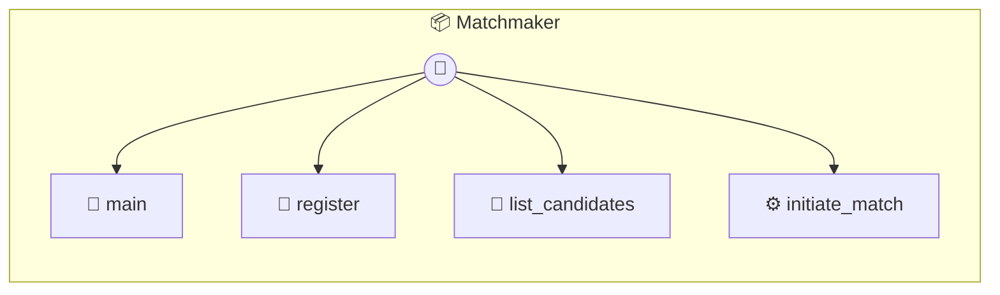

# Matchmaker

P2P Matchmaker Infrastructure A lightweight MCP for managing P2P connection pools and availability. The Host AI uses these tools to register the user and discover peers.

> **4 tools** · API Photon · v1.1.0 · MIT

**Platform Features:** `custom-ui` `dashboard`

## ⚙️ Configuration

No configuration required.


## 🔧 Tools


### `main`

Get local profile and pool stats


---


### `register`

Register or update user profile in the shared pool. Host AI should provide bio/goal based on user history.


| Parameter | Type | Required | Description |
|-----------|------|----------|-------------|
| `name` | string | Yes | User name |
| `bio` | string | Yes | Detailed background (Host AI should generate this) |
| `goal` | string | Yes | Current intent (Host AI should generate this) |
| `peerId` | string | Yes | WebRTC Peer ID for connections |


---


### `list_candidates`

List all available peers in the matching pool. Host AI will analyze this list to find the best match.


---


### `initiate_match`

Record a match and prepare for connection. Called by Host AI once it has selected a candidate.


| Parameter | Type | Required | Description |
|-----------|------|----------|-------------|
| `peerId` | string | Yes | The ID of the selected peer |
| `reason` | string | Yes | Why the Host AI chose this person |


---


## 🏗️ Architecture




## 📥 Usage

```bash
# Install from marketplace
photon add matchmaker

# Get MCP config for your client
photon info matchmaker --mcp
```

## 📦 Dependencies

No external dependencies.

---

MIT · v1.1.0 · Portel
