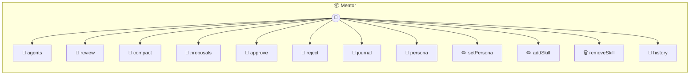

# Mentor

Mentor — reviews agent journals, evolves personas, manages skills. The "3am agent" that makes other agents better over time. Reads an agent's journal entries, conversation history, and current persona, then proposes improvements. All changes are git-committed for auditability. Can be triggered by: cron schedule, manual invocation, conversation threshold, or skill gap detection.

> **12 tools** · API Photon · v1.0.0 · MIT

**Platform Features:** `stateful`

## ⚙️ Configuration


| Variable | Required | Type | Description |
|----------|----------|------|-------------|
| `MENTOR_ROUTER` | Yes | any | No description available |


## 📋 Quick Reference

| Method | Description |
|--------|-------------|
| `agents` | List all agents with their current state. |
| `review` | Full mentor review: analyze journal + conversations, propose persona/skill changes. |
| `compact` | Compact conversation history into bucketed memory files. |
| `proposals` | List pending proposals for an agent. |
| `approve` | Approve a pending proposal. |
| `reject` | Reject a pending proposal. |
| `journal` | Show an agent's journal entries for a date range. |
| `persona` | Show an agent's current persona. |
| `setPersona` | Directly edit an agent's persona. |
| `addSkill` | Add a skill to an agent. |
| `removeSkill` | Remove a skill from an agent. |
| `history` | Show git history of an agent's evolution. |


## 🔧 Tools


### `agents`

List all agents with their current state.


---


### `review`

Full mentor review: analyze journal + conversations, propose persona/skill changes.


| Parameter | Type | Required | Description |
|-----------|------|----------|-------------|
| `agent` | string | Yes | Agent directory name (e.g. `"arul_and_lura"`) |


---


### `compact`

Compact conversation history into bucketed memory files.


| Parameter | Type | Required | Description |
|-----------|------|----------|-------------|
| `agent` | string | Yes | Agent directory name (e.g. `"arul_and_lura"`) |


---


### `proposals`

List pending proposals for an agent.


| Parameter | Type | Required | Description |
|-----------|------|----------|-------------|
| `agent` | string | Yes | Agent directory name (e.g. `"arul_and_lura"`) |


---


### `approve`

Approve a pending proposal.


| Parameter | Type | Required | Description |
|-----------|------|----------|-------------|
| `agent` | string | Yes | Agent directory name (e.g. `"arul_and_lura"`) |
| `proposal` | string | Yes | Proposal name (e.g. `"prefer-concise-responses"`) |


---


### `reject`

Reject a pending proposal.


| Parameter | Type | Required | Description |
|-----------|------|----------|-------------|
| `agent` | string | Yes | Agent directory name (e.g. `"arul_and_lura"`) |
| `proposal` | string | Yes | Proposal name (e.g. `"add-vision-skill"`) |


---


### `journal`

Show an agent's journal entries for a date range.


| Parameter | Type | Required | Description |
|-----------|------|----------|-------------|
| `agent` | string | Yes | Agent directory name (e.g. `"arul_and_lura"`) |
| `days` | number | No | Number of days to look back (e.g. `7`) |


---


### `persona`

Show an agent's current persona.


| Parameter | Type | Required | Description |
|-----------|------|----------|-------------|
| `agent` | string | Yes | Agent directory name (e.g. `"arul_and_lura"`) |


---


### `setPersona`

Directly edit an agent's persona.


| Parameter | Type | Required | Description |
|-----------|------|----------|-------------|
| `agent` | string | Yes | Agent directory name (e.g. `"arul_and_lura"`) |
| `content` | string | Yes | New persona content (e.g. `"You are Lura, a concise assistant who prefers direct answers."`) |


---


### `addSkill`

Add a skill to an agent.


| Parameter | Type | Required | Description |
|-----------|------|----------|-------------|
| `agent` | string | Yes | Agent directory name (e.g. `"arul_and_lura"`) |
| `skill` | string | Yes | Skill name or path (e.g. `"image-analysis"`) |


---


### `removeSkill`

Remove a skill from an agent.


| Parameter | Type | Required | Description |
|-----------|------|----------|-------------|
| `agent` | string | Yes | Agent directory name (e.g. `"arul_and_lura"`) |
| `skill` | string | Yes | Skill name (e.g. `"image-analysis"`) |


---


### `history`

Show git history of an agent's evolution.


| Parameter | Type | Required | Description |
|-----------|------|----------|-------------|
| `agent` | string | Yes | Agent directory name (e.g. `"arul_and_lura"`) |
| `count` | number | No | Number of commits to show (e.g. `20`) |


---


## 🏗️ Architecture




## 📥 Usage

```bash
# Install from marketplace
photon add mentor

# Get MCP config for your client
photon info mentor --mcp
```

## 📦 Dependencies

No external dependencies.

---

MIT · v1.0.0
