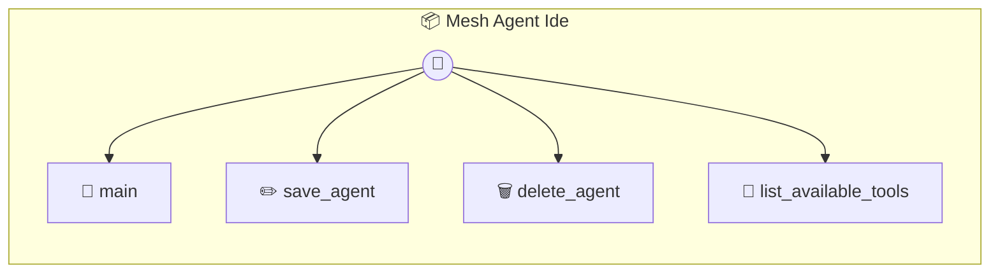

# Mesh Agent Ide

Mesh Agent IDE — Personality & Goal Configuration Customize the 'brains' of your local mesh agents. Define personalities, learning goals, and tool permissions.

> **4 tools** · API Photon · v1.0.0 · MIT

**Platform Features:** `custom-ui` `dashboard`

## ⚙️ Configuration

No configuration required.


## 🔧 Tools


### `main`

Main entry point for the IDE UI.


---


### `save_agent`

Create or update an agent persona.


| Parameter | Type | Required | Description |
|-----------|------|----------|-------------|
| `persona` | AgentPersona | Yes | The agent configuration object |


---


### `delete_agent`

Delete an agent persona.


| Parameter | Type | Required | Description |
|-----------|------|----------|-------------|
| `id` | string | Yes | The agent ID |


---


### `list_available_tools`

List available tools (photons) that can be assigned to agents.


---


## 🏗️ Architecture




## 📥 Usage

```bash
# Install from marketplace
photon add mesh-agent-ide

# Get MCP config for your client
photon info mesh-agent-ide --mcp
```

## 📦 Dependencies

No external dependencies.

---

MIT · v1.0.0 · Portel
