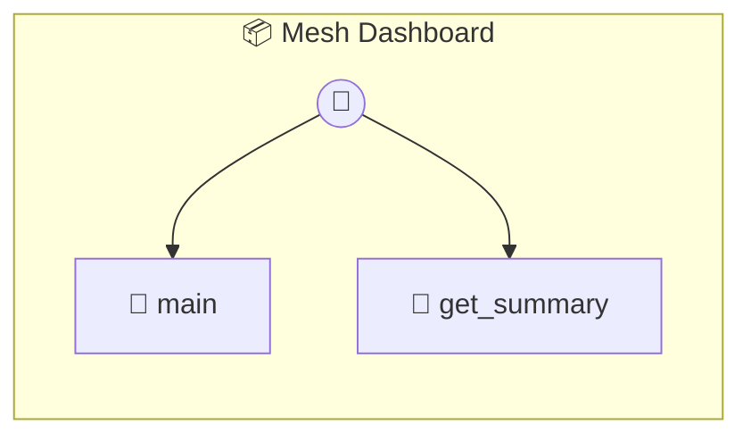

# Mesh Dashboard

Mesh Dashboard — The Live Heart of your P2P Economy Aggregates metrics, wealth, and reputation from across the Mesh. Your central command for monitoring mission performance and bazaar activity.

> **2 tools** · API Photon · v1.0.0 · MIT

**Platform Features:** `custom-ui` `dashboard`

## ⚙️ Configuration

No configuration required.


## 🔧 Tools


### `main`

Main entry point for the Dashboard UI. Aggregates data from global memory and other mesh photons.


---


### `get_summary`

Generate a summary report for the Host AI.


---


## 🏗️ Architecture




## 📥 Usage

```bash
# Install from marketplace
photon add mesh-dashboard

# Get MCP config for your client
photon info mesh-dashboard --mcp
```

## 📦 Dependencies

No external dependencies.

---

MIT · v1.0.0 · Portel
