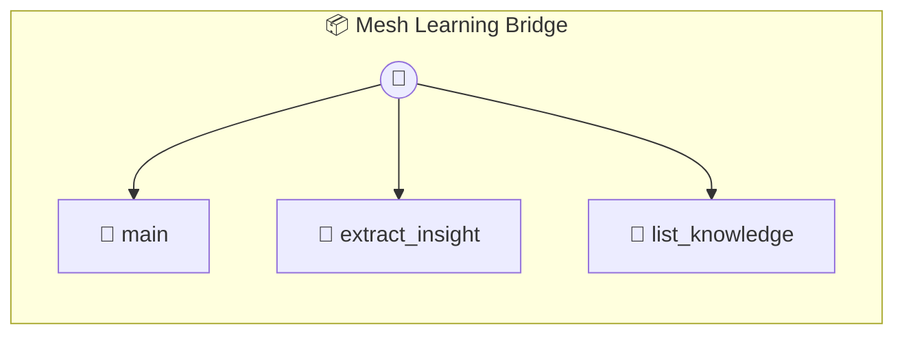

# Mesh Learning Bridge

Mesh Learning Bridge — Agent-to-Agent Knowledge Protocol Allows AI agents to extract, store, and share semantic learnings from P2P missions. Builds a local knowledge base of successful patterns and skills.

> **3 tools** · API Photon · v1.0.0 · MIT

**Platform Features:** `custom-ui` `dashboard`

## ⚙️ Configuration


| Variable | Required | Type | Description |
|----------|----------|------|-------------|
| `MESH_LEARNING_BRIDGE_CLAUDE` | Yes | any | No description available |


## 🔧 Tools


### `main`

View the local learning feed and knowledge base.


---


### `extract_insight`

Extract semantic insights from a completed mission. Host AI: Call this after a mission to capture what was learned.


| Parameter | Type | Required | Description |
|-----------|------|----------|-------------|
| `missionId` | string | Yes | ID of the source mission |
| `log` | string | Yes | Transcript or summary of the interaction |


---


### `list_knowledge`

List all stored knowledge categorized by topic.


---


## 🏗️ Architecture




## 📥 Usage

```bash
# Install from marketplace
photon add mesh-learning-bridge

# Get MCP config for your client
photon info mesh-learning-bridge --mcp
```

## 📦 Dependencies

No external dependencies.

---

MIT · v1.0.0 · Portel
