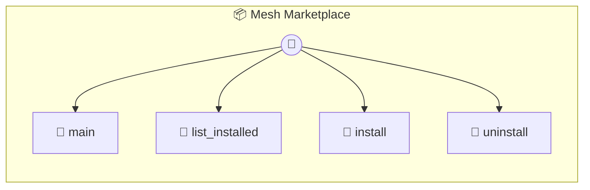

# Mesh Marketplace

Mesh Marketplace — Discover & Install Photons The central hub for expanding your local mesh ecosystem. Discover specialized agents, tools, and visual workspaces.

> **4 tools** · API Photon · v1.0.0 · MIT

**Platform Features:** `custom-ui`

## ⚙️ Configuration

No configuration required.


## 🔧 Tools


### `main`

Main entry point for the Store UI.


---


### `list_installed`

List all photons currently installed in the local mesh.


---


### `install`

Install a photon from the marketplace. Creates a symlink in ~/.photon/local.


| Parameter | Type | Required | Description |
|-----------|------|----------|-------------|
| `id` | string | Yes | Photon identifier from catalog |


---


### `uninstall`

Remove a photon from the local mesh.


| Parameter | Type | Required | Description |
|-----------|------|----------|-------------|
| `id` | string | Yes | Photon ID |


---


## 🏗️ Architecture




## 📥 Usage

```bash
# Install from marketplace
photon add mesh-marketplace

# Get MCP config for your client
photon info mesh-marketplace --mcp
```

## 📦 Dependencies

No external dependencies.

---

MIT · v1.0.0 · Portel
