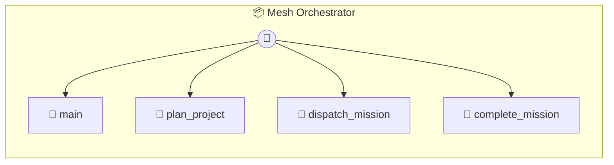

# Mesh Orchestrator

Mesh Orchestrator — Autonomous Task Decomposition Breaks down complex objectives into discrete P2P Missions. Automatically broadcasts tasks to the Bazaar and tracks completion.

> **4 tools** · API Photon · v1.0.0 · MIT

**Platform Features:** `custom-ui` `dashboard`

## ⚙️ Configuration


| Variable | Required | Type | Description |
|----------|----------|------|-------------|
| `MESH_ORCHESTRATOR_CLAUDE` | Yes | any | No description available |


## 🔧 Tools


### `main`

Get current projects and active missions.


---


### `plan_project`

Break a project objective into small P2P missions using AI.


| Parameter | Type | Required | Description |
|-----------|------|----------|-------------|
| `name` | string | Yes | Project name |
| `objective` | string | Yes | The high-level goal |


---


### `dispatch_mission`

Broadcast a planned mission to the Bazaar.


| Parameter | Type | Required | Description |
|-----------|------|----------|-------------|
| `projectId` | string | Yes | Project ID |
| `missionId` | string | Yes | Mission ID |


---


### `complete_mission`

Mark a mission as completed.


---


## 🏗️ Architecture




## 📥 Usage

```bash
# Install from marketplace
photon add mesh-orchestrator

# Get MCP config for your client
photon info mesh-orchestrator --mcp
```

## 📦 Dependencies

No external dependencies.

---

MIT · v1.0.0 · Portel
