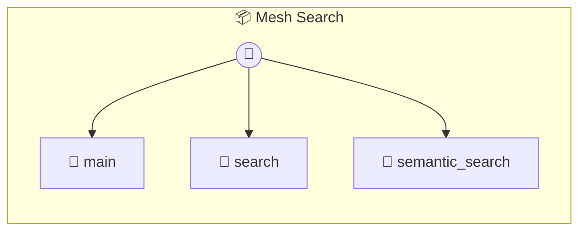

# Mesh Search

Mesh Search — Universal Discovery for your P2P History Find anything across your entire mesh: snapshots, missions, learnings, and agents. Features: Cross-memory scanning and AI-powered semantic search.

> **3 tools** · API Photon · v1.0.0 · MIT

**Platform Features:** `custom-ui` `dashboard`

## ⚙️ Configuration


| Variable | Required | Type | Description |
|----------|----------|------|-------------|
| `MESH_SEARCH_CLAUDE` | Yes | any | No description available |


## 🔧 Tools


### `main`

Main entry point for the Search UI.


---


### `search`

Search for items across the entire mesh using keywords.


| Parameter | Type | Required | Description |
|-----------|------|----------|-------------|
| `query` | string | Yes | Search keywords |


---


### `semantic_search`

Perform an AI-powered semantic search. Finds items that match the meaning, even if keywords don't match.


| Parameter | Type | Required | Description |
|-----------|------|----------|-------------|
| `query` | string | Yes | The search intent (e.g. "everything related to react debugging") |


---


## 🏗️ Architecture




## 📥 Usage

```bash
# Install from marketplace
photon add mesh-search

# Get MCP config for your client
photon info mesh-search --mcp
```

## 📦 Dependencies

No external dependencies.

---

MIT · v1.0.0 · Portel
