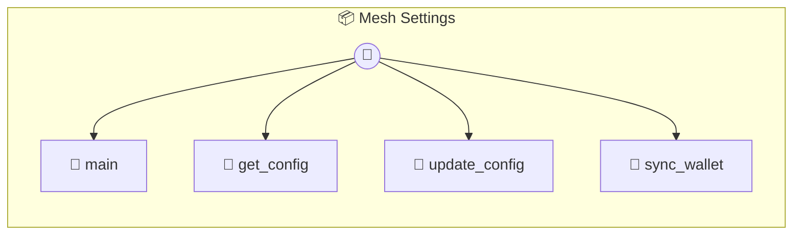

# Mesh Settings

Mesh Control Center — Global Settings & Themes The central brain for your P2P Mesh identity and appearance. Manages shared profile, wallet status, and UI themes across all mesh photons.

> **4 tools** · API Photon · v1.0.0 · MIT

**Platform Features:** `custom-ui`

## ⚙️ Configuration

No configuration required.


## 🔧 Tools


### `main`

Get the global mesh configuration.


---


### `get_config`

Retrieve the current global configuration. Other photons call this to sync identity and theme.


---


### `update_config`

Update global mesh settings.


| Parameter | Type | Required | Description |
|-----------|------|----------|-------------|
| `profile` | any | No | User identity object |
| `theme` | any | No | UI customization object |


---


### `sync_wallet`

Force a sync of all mesh credits (Local Settlement).


---


## 🏗️ Architecture




## 📥 Usage

```bash
# Install from marketplace
photon add mesh-settings

# Get MCP config for your client
photon info mesh-settings --mcp
```

## 📦 Dependencies

No external dependencies.

---

MIT · v1.0.0 · Portel
