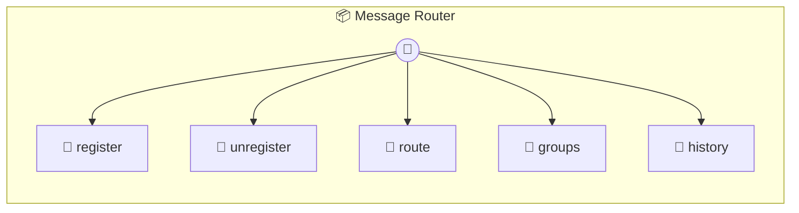

# Message Router

Message Router — routes inbound WhatsApp messages to Claude agents. Maintains a registry of groups/chats. When a message arrives via `route()`, it checks the trigger pattern and registered groups, then emits a routing decision for the agent runner to act on. Pair with whatsapp (poll its pending() method and call router.route() for each message).

> **5 tools** · API Photon · v1.0.0 · MIT

**Platform Features:** `stateful`

## ⚙️ Configuration

No configuration required.


## 🔧 Tools


### `register`

Register a group or chat for agent routing.


| Parameter | Type | Required | Description |
|-----------|------|----------|-------------|
| `jid` | string | Yes | WhatsApp JID of the group/chat (e.g. `"123456789@g.us"`) |
| `name` | string | Yes | Display name (e.g. `"Dev Team"`) |
| `folder` | string | Yes | Filesystem folder name for group context (e.g. `"dev-team"`) |
| `trigger` | string | Yes | Trigger word or pattern (regex string) (e.g. `"@bot"`) |
| `requiresTrigger` | boolean | No | If true, only messages containing the trigger are routed |


---


### `unregister`

Unregister a group or chat from routing.


| Parameter | Type | Required | Description |
|-----------|------|----------|-------------|
| `jid` | string | Yes | WhatsApp JID to unregister |


---


### `route`

Route an inbound message. Checks if the chat is registered and whether the trigger pattern matches. Emits { type: 'routed' } or { type: 'ignored' }.


| Parameter | Type | Required | Description |
|-----------|------|----------|-------------|
| `jid` | string | Yes | Chat JID the message came from |
| `from` | string | Yes | Sender identifier |
| `text` | string | Yes | Message text content |
| `fromMe` | boolean | No | Whether the message was sent by the bot |
| `pushName` | string | No | Sender display name |
| `timestamp` | number | Yes | Unix timestamp of the message |


---


### `groups`

List all registered groups.


---


### `history`

Get recent routed messages for a group.


| Parameter | Type | Required | Description |
|-----------|------|----------|-------------|
| `folder` | string | Yes | Group folder name |
| `limit` | number | No | Max messages to return |


---


## 🏗️ Architecture




## 📥 Usage

```bash
# Install from marketplace
photon add message-router

# Get MCP config for your client
photon info message-router --mcp
```

## 📦 Dependencies

No external dependencies.

---

MIT · v1.0.0
