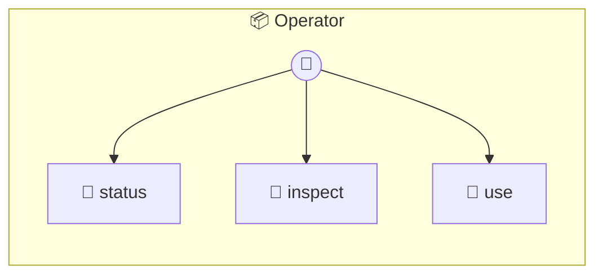

# Operator

Operator — macOS computer-use photon Direct macOS interaction through Peekaboo with optional local-model planning. Designed as a desktop operator, separate from Lookout's web/visual QA role.

> **3 tools** · API Photon · v1.0.0 · MIT

**Platform Features:** `stateful`

## ⚙️ Configuration

No configuration required.


## 🔧 Tools


### `status`

Check local readiness for Operator


---


### `inspect`

Inspect the current macOS UI state


| Parameter | Type | Required | Description |
|-----------|------|----------|-------------|
| `app` | any | Yes | Optional application name |
| `mode` | 'screen' | 'window' | 'frontmost' | No | Capture mode {@default window} |
| `screenIndex` | number | No | Optional screen index |


---


### `use`

Use a macOS app toward a goal through Peekaboo


| Parameter | Type | Required | Description |
|-----------|------|----------|-------------|
| `app` | any | Yes | Optional application name |
| `goal` | string | Yes | What to accomplish |
| `url` | string | No | Optional URL/file to open first |
| `maxSteps` | number | No | Max action steps {@default 6} |
| `mode` | 'screen' | 'window' | 'frontmost' | No | Capture mode {@default window} |
| `screenIndex` | number | No | Optional screen index |
| `allowDestructive` | boolean | No | Allow destructive actions |
| `profile` | boolean | No | Include timing breakdown |


---


## 🏗️ Architecture




## 📥 Usage

```bash
# Install from marketplace
photon add operator

# Get MCP config for your client
photon info operator --mcp
```

## 📦 Dependencies

No external dependencies.

---

MIT · v1.0.0
