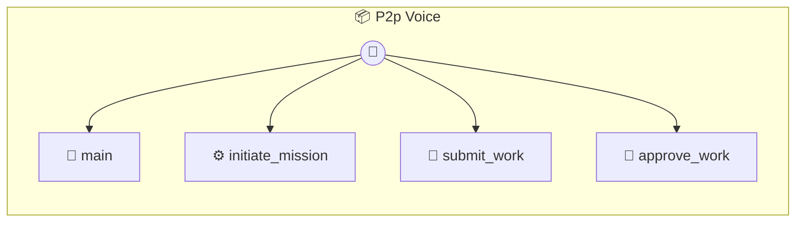

# P2p Voice

P2P Work Mesh (Artifacts & Presence) A universal marketplace for P2P services. Supports: Voice/Video Missions, Digital Asset Delivery, and Proof-of-Work.

> **4 tools** · API Photon · v1.6.0 · MIT

**Platform Features:** `custom-ui`

## ⚙️ Configuration

No configuration required.


## 🔧 Tools


### `main`

Main entry point.


---


### `initiate_mission`

Initiate a Mission (Call or Task).


| Parameter | Type | Required | Description |
|-----------|------|----------|-------------|
| `type` | 'voice' | 'video' | 'task' | Yes | "voice" | "video" | "task" |
| `intent` | string | Yes | Description of what needs to be delivered |


---


### `submit_work`

Provider submits the work (Proof of Work).


| Parameter | Type | Required | Description |
|-----------|------|----------|-------------|
| `content` | string | Yes | The artifact (URL, code, base64, or "session_complete") |
| `notes` | string | No | Delivery notes |


---


### `approve_work`

Seeker approves the work and releases credits.


---


## 🏗️ Architecture




## 📥 Usage

```bash
# Install from marketplace
photon add p2p-voice

# Get MCP config for your client
photon info p2p-voice --mcp
```

## 📦 Dependencies

No external dependencies.

---

MIT · v1.6.0
