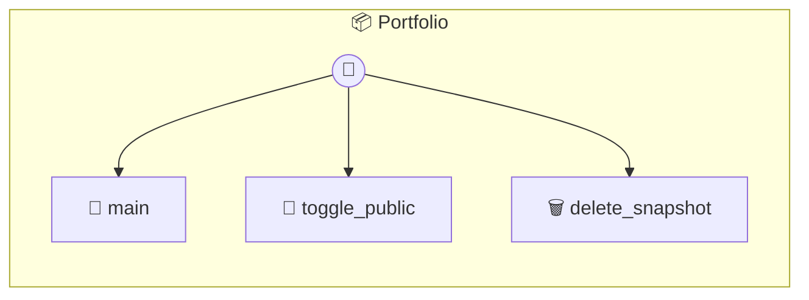

# Portfolio

P2P Portfolio — The Visual Track Record Showcases collaboration snapshots and mission history. Helps you build trust and proof-of-work in the P2P Mesh.

> **3 tools** · API Photon · v1.0.0 · MIT

**Platform Features:** `custom-ui`

## ⚙️ Configuration

No configuration required.


## 🔧 Tools


### `main`

Main entry point for the Portfolio viewer.


---


### `toggle_public`

Toggle public visibility of a snapshot. (In this P2P world, this flag tells the Host AI if it can share this with potential seekers)


---


### `delete_snapshot`

Delete a snapshot from the local record.


---


## 🏗️ Architecture




## 📥 Usage

```bash
# Install from marketplace
photon add portfolio

# Get MCP config for your client
photon info portfolio --mcp
```

## 📦 Dependencies

No external dependencies.

---

MIT · v1.0.0 · Portel
