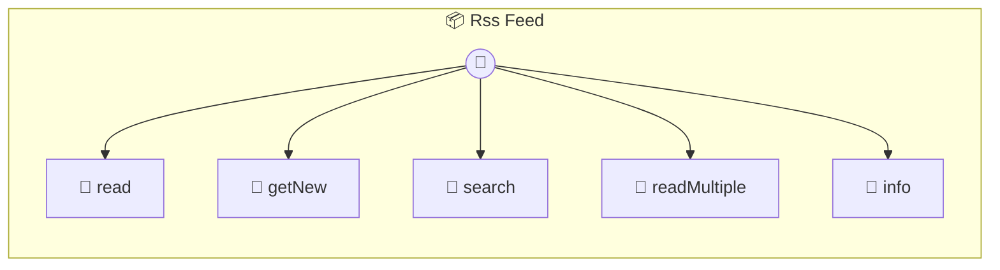

# RSS Feed

Read and parse RSS/Atom feeds Like n8n's RSS Read node - monitor blogs, news, and content feeds Perfect for: - Content aggregation - News monitoring - Blog post notifications - Podcast feed parsing

> **5 tools** · API Photon · v1.18.0 · MIT


## ⚙️ Configuration

No configuration required.


## 🔧 Tools


### `read`

Read and parse an RSS/Atom feed


| Parameter | Type | Required | Description |
|-----------|------|----------|-------------|
| `url` | string | Yes | Feed URL to parse |
| `limit` | number | No | Maximum number of items to return |


---


### `getNew`

Get new items since a specific date


| Parameter | Type | Required | Description |
|-----------|------|----------|-------------|
| `url` | string | Yes | Feed URL |
| `since` | string | Yes | ISO date string - only return items newer than this |


---


### `search`

Search feed items by keyword


| Parameter | Type | Required | Description |
|-----------|------|----------|-------------|
| `url` | string | Yes | Feed URL |
| `query` | string | Yes | Search query (searches title and description) |
| `limit` | number | No | Maximum results |


---


### `readMultiple`

Monitor multiple feeds at once


| Parameter | Type | Required | Description |
|-----------|------|----------|-------------|
| `urls` | string[] | Yes | Array of feed URLs |
| `limit` | number | No | Items per feed |


---


### `info`

Get feed metadata without items


| Parameter | Type | Required | Description |
|-----------|------|----------|-------------|
| `url` | string | Yes | Feed URL |


---


## 🏗️ Architecture




## 📥 Usage

```bash
# Install from marketplace
photon add rss-feed

# Get MCP config for your client
photon info rss-feed --mcp
```

## 📦 Dependencies

No external dependencies.

---

MIT · v1.18.0
