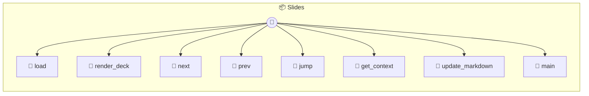

# Slides

Slides — AI-Native Marp Presentation Tool Manages presentations using the Marp Markdown format. Supports real-time AI-controlled slide transitions and high-fidelity rendering.

> **8 tools** · API Photon · v1.0.0 · MIT

**Platform Features:** `custom-ui`

## ⚙️ Configuration

No configuration required.


## 📋 Quick Reference

| Method | Description |
|--------|-------------|
| `load` | Initializes the slide deck from a Marp markdown string or file path. |
| `render_deck` | Renders the current markdown into HTML and CSS using Marp. |
| `next` | Move to the next slide. |
| `prev` | Move to the previous slide. |
| `jump` | Jump to a specific slide index. |
| `get_context` | Get context for the AI to understand the current presentation state. |
| `update_markdown` | Update the full markdown content. |
| `main` | Default tool to open the presentation UI. |


## 🔧 Tools


### `load`

Initializes the slide deck from a Marp markdown string or file path.


| Parameter | Type | Required | Description |
|-----------|------|----------|-------------|
| `source` | any | Yes | Marp Markdown content or path to .md file |


---


### `render_deck`

Renders the current markdown into HTML and CSS using Marp.


---


### `next`

Move to the next slide.


---


### `prev`

Move to the previous slide.


---


### `jump`

Jump to a specific slide index.


| Parameter | Type | Required | Description |
|-----------|------|----------|-------------|
| `index` | any | Yes | 0-based slide index |


---


### `get_context`

Get context for the AI to understand the current presentation state.


---


### `update_markdown`

Update the full markdown content.


| Parameter | Type | Required | Description |
|-----------|------|----------|-------------|
| `markdown` | any | Yes | New Marp markdown content |


---


### `main`

Default tool to open the presentation UI.


---


## 🏗️ Architecture




## 📥 Usage

```bash
# Install from marketplace
photon add slides

# Get MCP config for your client
photon info slides --mcp
```

## 📦 Dependencies


```
@marp-team/marp-core@^4.3.0
```

---

MIT · v1.0.0 · Portel
