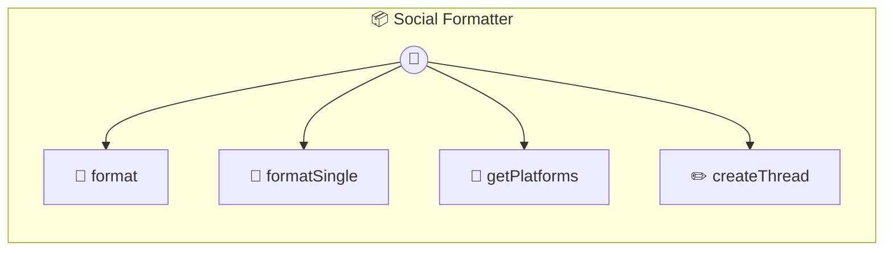

# Social Formatter

Social Media Formatter Takes markdown content and formats it optimally for different social media platforms. Each platform has different constraints (character limits, formatting support, etc.)

> **4 tools** · API Photon · v1.18.0 · MIT


## ⚙️ Configuration

No configuration required.


## 🔧 Tools


### `format`

Format markdown content for multiple social media platforms


| Parameter | Type | Required | Description |
|-----------|------|----------|-------------|
| `content` | string | Yes | - Markdown content to format |
| `platforms` | string[] | No | - Target platforms |
| `includeHashtags` | boolean | No | - Auto-extract hashtags from content |


---


### `formatSingle`

Format content for a single platform


---


### `getPlatforms`

Get platform constraints


---


### `createThread`

Create a thread from long content (for Twitter, Threads, etc.)


---


## 🏗️ Architecture




## 📥 Usage

```bash
# Install from marketplace
photon add social-formatter

# Get MCP config for your client
photon info social-formatter --mcp
```

## 📦 Dependencies


```
@portel/photon-core@latest
```

---

MIT · v1.18.0
