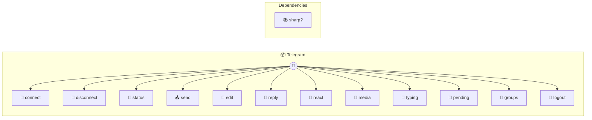

# Telegram

Max age for queued messages before they're dropped on flush (1 hour)

> **12 tools** · API Photon · v1.0.0 · MIT

**Platform Features:** `stateful` `channels`

## ⚙️ Configuration

No configuration required.


## 📋 Quick Reference

| Method | Description |
|--------|-------------|
| `connect` | Connect to Telegram with a bot token from BotFather. |
| `disconnect` | Disconnect from Telegram. |
| `status` | Connection and bot status. |
| `send` | Send a text message to a chat. |
| `edit` | Edit a previously sent message. |
| `reply` | Reply to a specific message (quoted reply). |
| `react` | React to a message with an emoji. |
| `media` | Send media (photo, video, audio, or document). |
| `typing` | Set typing indicator for a chat. |
| `pending` | Return and clear buffered inbound messages. |
| `groups` | List known chats (groups and DMs discovered from incoming messages). |
| `logout` | Remove saved bot token and disconnect. |


## 🔧 Tools


### `connect`

Connect to Telegram with a bot token from BotFather. Saves the token for automatic reconnection on restart.


| Parameter | Type | Required | Description |
|-----------|------|----------|-------------|
| `token` | string | Yes | Bot token from @BotFather (e.g. `"123456:ABC-DEF1234ghIkl-zyx57W2v1u123ew11"`) |


---


### `disconnect`

Disconnect from Telegram. Stops receiving messages.


---


### `status`

Connection and bot status.


---


### `send`

Send a text message to a chat. Supports markdown formatting — converted to Telegram HTML automatically.


| Parameter | Type | Required | Description |
|-----------|------|----------|-------------|
| `chat` | string | Yes | Chat name or ID [choice-from: groups.name] |
| `text` | string | Yes | Message text (supports Markdown) |


---


### `edit`

Edit a previously sent message.


| Parameter | Type | Required | Description |
|-----------|------|----------|-------------|
| `chat` | string | Yes | Chat name or ID [choice-from: groups.name] |
| `messageId` | number | Yes | Message ID to edit |
| `text` | string | Yes | New text (supports Markdown) |


---


### `reply`

Reply to a specific message (quoted reply).


| Parameter | Type | Required | Description |
|-----------|------|----------|-------------|
| `chat` | string | Yes | Chat name or ID [choice-from: groups.name] |
| `text` | string | Yes | Reply text (supports Markdown) |
| `messageId` | number | Yes | Message ID to reply to |


---


### `react`

React to a message with an emoji.


| Parameter | Type | Required | Description |
|-----------|------|----------|-------------|
| `chat` | string | Yes | Chat name or ID [choice-from: groups.name] |
| `messageId` | number | Yes | Message ID to react to |
| `emoji` | string | Yes | Emoji to react with (empty string to remove) (e.g. `"👍"`) |


---


### `media`

Send media (photo, video, audio, or document).


| Parameter | Type | Required | Description |
|-----------|------|----------|-------------|
| `chat` | string | Yes | Chat name or ID [choice-from: groups.name] |
| `url` | string | Yes | File URL or Telegram file_id |
| `type` | 'photo' | 'video' | 'audio' | 'document' | Yes | Media type [choice: photo, video, audio, document] |
| `caption` | string | No | Optional caption |


---


### `typing`

Set typing indicator for a chat. Telegram typing indicators auto-expire after ~5 seconds.


| Parameter | Type | Required | Description |
|-----------|------|----------|-------------|
| `chat` | string | Yes | Chat name or ID [choice-from: groups.name] |
| `typing` | boolean | Yes | True to show typing (false is a no-op — Telegram auto-expires) |


---


### `pending`

Return and clear buffered inbound messages. If polling is idle (no subscribers), does a one-shot fetch from Telegram first.


---


### `groups`

List known chats (groups and DMs discovered from incoming messages). Note: Telegram Bot API has no "list all chats" endpoint — this index builds incrementally from received messages.


---


### `logout`

Remove saved bot token and disconnect. You'll need to call connect() again with a new token.


---


## 🏗️ Architecture




## 📥 Usage

```bash
# Install from marketplace
photon add telegram

# Get MCP config for your client
photon info telegram --mcp
```

## 📦 Dependencies


```
sharp?
```

---

MIT · v1.0.0
