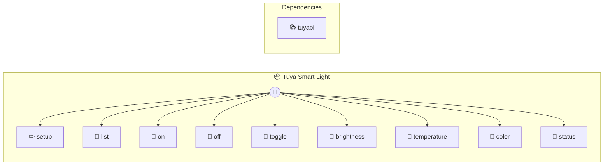

# Tuya Smart Light

Control Tuya/Wipro/Smart Life WiFi bulbs Provides comprehensive control of Tuya-based smart lights via local network. Automatically syncs devices from Tuya Cloud and discovers them on local network. Common use cases: - Setup: "Configure Tuya Cloud credentials once" - List: "Show all my smart lights" - Control: "Turn on Living Room", "Set brightness to 50%" - Color: "Set color to red", "Set warm white" Example workflow: 1. setup({ client_id, client_secret, region }) - Configure Tuya Cloud (one-time) 2. list() - See all devices (auto-synced from cloud + local network) 3. on({ name: "Living Room" }) - Control by name or device_id Setup Guide for Tuya Cloud API: 1. Create account at https://iot.tuya.com/ 2. Create a new Cloud Project 3. Link your Smart Life app account (scan QR in "Me" tab) 4. Get Access ID (client_id) and Access Secret (client_secret) 5. Enable "Device Management" API permission 6. Wait ~10 minutes for permissions to activate 7. Run setup() once with your credentials All device data and credentials stored in ~/.photon/tuya-smart-light.json Dependencies are auto-installed on first run.

> **9 tools** · API Photon · v2.1.0 · MIT

**Platform Features:** `stateful`

## ⚙️ Configuration


| Variable | Required | Type | Description |
|----------|----------|------|-------------|
| `TUYA_SMART_LIGHT_DEVICES_FILE` | No | string | No description available |


## 📋 Quick Reference

| Method | Description |
|--------|-------------|
| `setup` | Setup Tuya Cloud API credentials (one-time configuration) |
| `list` | List all Tuya devices (auto-synced from cloud and local network) |
| `on` | Turn light on |
| `off` | Turn light off |
| `toggle` | Toggle light on/off |
| `brightness` | Set brightness level |
| `temperature` | Set color temperature (warm to cool white) |
| `color` | Set color (supports hex RGB or color names) |
| `status` | Get device status |


## 🔧 Tools


### `setup`

Setup Tuya Cloud API credentials (one-time configuration)


| Parameter | Type | Required | Description |
|-----------|------|----------|-------------|
| `client_id` | string | Yes | Tuya Cloud Access ID (from iot.tuya.com) |
| `client_secret` | string | Yes | Tuya Cloud Access Secret (from iot.tuya.com) |
| `region` | string | No | Tuya region: "us", "eu", "cn", or "in" |


---


### `list`

List all Tuya devices (auto-synced from cloud and local network)


| Parameter | Type | Required | Description |
|-----------|------|----------|-------------|
| `refresh` | any | No | Force refresh from cloud and local network |


---


### `on`

Turn light on


| Parameter | Type | Required | Description |
|-----------|------|----------|-------------|
| `device_id` | any | Yes | Device ID (optional if name provided) |
| `name` | string } | No | Device name (optional if device_id provided) |


---


### `off`

Turn light off


| Parameter | Type | Required | Description |
|-----------|------|----------|-------------|
| `device_id` | any | Yes | Device ID (optional if name provided) |
| `name` | string } | No | Device name (optional if device_id provided) |


---


### `toggle`

Toggle light on/off


| Parameter | Type | Required | Description |
|-----------|------|----------|-------------|
| `device_id` | any | Yes | Device ID (optional if name provided) |
| `name` | string } | No | Device name (optional if device_id provided) |


---


### `brightness`

Set brightness level


| Parameter | Type | Required | Description |
|-----------|------|----------|-------------|
| `level` | number | { level: number | Yes | Brightness level (0-1000) |
| `device_id` | string | No | Device ID (optional if name provided) |
| `name` | string } | No | Device name (optional if device_id provided) |


---


### `temperature`

Set color temperature (warm to cool white)


| Parameter | Type | Required | Description |
|-----------|------|----------|-------------|
| `temp` | number | { temp: number | Yes | Temperature value (0-1000, where 0 is warm, 1000 is cool) |
| `device_id` | string | No | Device ID (optional if name provided) |
| `name` | string } | No | Device name (optional if device_id provided) |


---


### `color`

Set color (supports hex RGB or color names)


| Parameter | Type | Required | Description |
|-----------|------|----------|-------------|
| `color` | string | { color: string | Yes | Color as hex (FF0000, #FF0000) or name (red, blue, green, etc.) |
| `device_id` | string | No | Device ID (optional if name provided) |
| `name` | string } | No | Device name (optional if device_id provided) |


---


### `status`

Get device status


| Parameter | Type | Required | Description |
|-----------|------|----------|-------------|
| `device_id` | any | Yes | Device ID (optional if name provided) |
| `name` | string } | No | Device name (optional if device_id provided) |


---


## 🏗️ Architecture




## 📥 Usage

```bash
# Install from marketplace
photon add tuya-smart-light

# Get MCP config for your client
photon info tuya-smart-light --mcp
```

## 📦 Dependencies


```
tuyapi@^7.7.0
```

---

MIT · v2.1.0 · Photon
