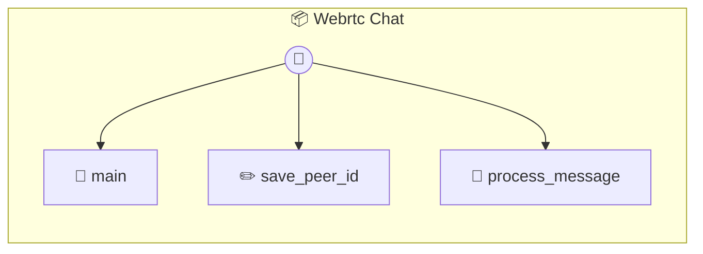

# Webrtc Chat

WebRTC P2P Video Chat A peer-to-peer video, voice, and text chat application using WebRTC. Uses PeerJS for cloud signaling so no backend deployment is required.

> **3 tools** · API Photon · v1.0.0 · MIT

**Platform Features:** `custom-ui`

## ⚙️ Configuration


| Variable | Required | Type | Description |
|----------|----------|------|-------------|
| `WEB_R_T_C_CHAT_CLAUDE` | Yes | any | No description available |


## 🔧 Tools


### `main`

Open the WebRTC Video Chat interface


---


### `save_peer_id`

Save the local Peer ID for future sessions


| Parameter | Type | Required | Description |
|-----------|------|----------|-------------|
| `peerId` | string | Yes | The generated Peer ID to remember |


---


### `process_message`

Process an incoming text message and generate an auto-reply if Agent Mode is active.


| Parameter | Type | Required | Description |
|-----------|------|----------|-------------|
| `text` | string | Yes | The text message received |
| `from` | string | Yes | The ID of the sender |


---


## 🏗️ Architecture




## 📥 Usage

```bash
# Install from marketplace
photon add webrtc-chat

# Get MCP config for your client
photon info webrtc-chat --mcp
```

## 📦 Dependencies

No external dependencies.

---

MIT · v1.0.0 · Portel
