# Whatsapp

Max age for queued messages before they're dropped on flush (1 hour)

> **35 tools** · API Photon · v1.0.0 · MIT

**Platform Features:** `custom-ui` `stateful` `channels` `dashboard`

## ⚙️ Configuration


| Variable | Required | Type | Description |
|----------|----------|------|-------------|
| `WHATS_APP__AUTHDIR` | No | string | No description available |


## 📋 Quick Reference

| Method | Description |
|--------|-------------|
| `main` | WhatsApp Dashboard |
| `connect` | Connect to WhatsApp. |
| `disconnect` | Disconnect from WhatsApp gracefully. |
| `send` | Send a message to a WhatsApp chat. |
| `edit` | Edit a previously sent message in-place. |
| `reply` | Reply to a specific message in a WhatsApp chat. |
| `react` | React to a message with an emoji. |
| `media` | Send media (image, video, audio, or document) to a WhatsApp chat. |
| `status` | Return the current connection status. |
| `groups` | List all known WhatsApp groups. |
| `pending` | Return and clear buffered inbound messages since last call. |
| `invite` | Generate a group invite link. |
| `members` | List members of a group with their roles. |
| `admin` | Group admin operations: add, remove, promote, or demote members. |
| `typing` | Set typing indicator for a chat. |
| `audit` | Audit all groups — lists every group with participant count, creation date, and description. |
| `leave` | Leave a WhatsApp group. |
| `rename` | Rename a WhatsApp group. |
| `describe` | Set or clear a group's description. |
| `ephemeral` | Toggle disappearing messages for a group. |
| `requests` | View and manage pending join requests for a group. |
| `handle` | Approve or reject pending join requests for a group. |
| `restrict` | Lock or unlock group settings. |
| `mute` | Mute or unmute a chat. |
| `archive` | Archive or unarchive a chat. |
| `pin` | Pin or unpin a chat. |
| `read` | Mark a chat as read or unread. |
| `lookup` | Check if phone numbers exist on WhatsApp. |
| `block` | Block a contact. |
| `unblock` | Unblock a contact. |
| `blocked` | List all blocked contacts. |
| `privacy` | View current privacy settings. |
| `setPrivacy` | Update a privacy setting. |
| `setStatus` | Update your profile status message. |
| `cleanup` | Clear chat history for groups to reclaim storage. |


## 🔧 Tools


### `main`

WhatsApp Dashboard


---


### `connect`

Connect to WhatsApp. If already authenticated, connects immediately. If not, returns a QR code to scan. The connection completes asynchronously — call status() to check when it's ready.


---


### `disconnect`

Disconnect from WhatsApp gracefully.


---


### `send`

Send a message to a WhatsApp chat. Accepts a group name, phone number, or raw JID. Queues automatically if currently disconnected.


| Parameter | Type | Required | Description |
|-----------|------|----------|-------------|
| `chat` | string | Yes | Group name, phone number, or JID [choice-from: groups.name] (e.g. `"Arul and Lura"`) |
| `text` | string | Yes | Message text to send |


---


### `edit`

Edit a previously sent message in-place. Only works on messages sent by this bot. The JID is derived from the message key — no chat param needed.


| Parameter | Type | Required | Description |
|-----------|------|----------|-------------|
| `key` | MessageKey | Yes | Message key returned from send() |
| `text` | string | Yes | New message text |


---


### `reply`

Reply to a specific message in a WhatsApp chat. The reply appears threaded/quoted in WhatsApp.


| Parameter | Type | Required | Description |
|-----------|------|----------|-------------|
| `chat` | string | Yes | Group name, phone number, or JID [choice-from: groups.name] |
| `text` | string | Yes | Reply text |
| `quotedId` | string | Yes | Message ID to reply to (from inbound message's messageId field) |


---


### `react`

React to a message with an emoji. Send an empty emoji string to remove a reaction.


| Parameter | Type | Required | Description |
|-----------|------|----------|-------------|
| `chat` | string | Yes | Group name, phone number, or JID [choice-from: groups.name] |
| `messageId` | string | Yes | Message ID to react to |
| `emoji` | string | Yes | Emoji to react with (e.g. "👍"), or empty string to remove (e.g. `"👍"`) |


---


### `media`

Send media (image, video, audio, or document) to a WhatsApp chat. Accepts a URL or local file path as the source.


| Parameter | Type | Required | Description |
|-----------|------|----------|-------------|
| `chat` | string | Yes | Group name, phone number, or JID [choice-from: groups.name] |
| `url` | string | Yes | URL or local file path of the media |
| `type` | 'image' | 'video' | 'audio' | 'document' | Yes | Media type [choice: image, video, audio, document] |
| `caption` | string | No | Optional caption for the media |
| `filename` | string | No | Optional filename (used for document type) |


---


### `status`

Return the current connection status.


---


### `groups`

List all known WhatsApp groups.


---


### `pending`

Return and clear buffered inbound messages since last call. Used by orchestrators (e.g. claw) to poll for new messages.


---


### `invite`

Generate a group invite link.


| Parameter | Type | Required | Description |
|-----------|------|----------|-------------|
| `chat` | string | Yes | Group name or JID [choice-from: groups.name] |


---


### `members`

List members of a group with their roles.


| Parameter | Type | Required | Description |
|-----------|------|----------|-------------|
| `chat` | string | Yes | Group name or JID [choice-from: groups.name] |


---


### `admin`

Group admin operations: add, remove, promote, or demote members.


| Parameter | Type | Required | Description |
|-----------|------|----------|-------------|
| `chat` | string | Yes | Group name or JID [choice-from: groups.name] |
| `action` | 'add' | 'remove' | 'promote' | 'demote' | Yes | Admin action to perform [choice: add, remove, promote, demote] |
| `members` | string[] | Yes | Array of member JIDs to act on |


---


### `typing`

Set typing indicator for a chat.


| Parameter | Type | Required | Description |
|-----------|------|----------|-------------|
| `chat` | string | Yes | Group name, phone number, or JID [choice-from: groups.name] |
| `typing` | boolean | Yes | True to show composing, false to clear |


---


### `audit`

Audit all groups — lists every group with participant count, creation date, and description. Useful for finding large, dead, or forgotten groups.


| Parameter | Type | Required | Description |
|-----------|------|----------|-------------|
| `sort` | string | No | Sort by: 'size' (most members), 'name', or 'created' {@default size} [choice: size, name, created] |
| `minMembers` | number | No | Only show groups with at least this many members {@default 0} [min: 0] |


---


### `leave`

Leave a WhatsApp group.


| Parameter | Type | Required | Description |
|-----------|------|----------|-------------|
| `chat` | string | Yes | Group name or JID [choice-from: groups.name] |


---


### `rename`

Rename a WhatsApp group.


| Parameter | Type | Required | Description |
|-----------|------|----------|-------------|
| `chat` | string | Yes | Group name or JID [choice-from: groups.name] |
| `name` | string | Yes | New group name (e.g. `"Project Alpha"`) |


---


### `describe`

Set or clear a group's description.


| Parameter | Type | Required | Description |
|-----------|------|----------|-------------|
| `chat` | string | Yes | Group name or JID [choice-from: groups.name] |
| `description` | string | Yes | New description (empty to clear) |


---


### `ephemeral`

Toggle disappearing messages for a group.


| Parameter | Type | Required | Description |
|-----------|------|----------|-------------|
| `chat` | string | Yes | Group name or JID [choice-from: groups.name] |
| `duration` | string | Yes | Duration: 'off', '24h', '7d', '90d' {@default off} [choice: off, 24h, 7d, 90d] |


---


### `requests`

View and manage pending join requests for a group.


| Parameter | Type | Required | Description |
|-----------|------|----------|-------------|
| `chat` | string | Yes | Group name or JID [choice-from: groups.name] |


---


### `handle`

Approve or reject pending join requests for a group.


| Parameter | Type | Required | Description |
|-----------|------|----------|-------------|
| `chat` | string | Yes | Group name or JID [choice-from: groups.name] |
| `members` | string[] | Yes | JIDs of requesters to handle |
| `action` | 'approve' | 'reject' | Yes | Approve or reject [choice: approve, reject] |


---


### `restrict`

Lock or unlock group settings. Locked = only admins can edit group info. Announcement = only admins can send messages.


| Parameter | Type | Required | Description |
|-----------|------|----------|-------------|
| `chat` | string | Yes | Group name or JID [choice-from: groups.name] |
| `setting` | string | Yes | Setting to apply [choice: announcement, not_announcement, locked, unlocked] |


---


### `mute`

Mute or unmute a chat.


| Parameter | Type | Required | Description |
|-----------|------|----------|-------------|
| `chat` | string | Yes | Group name, phone number, or JID [choice-from: groups.name] |
| `duration` | string | Yes | Mute duration: '8h', '1w', 'forever', or 'off' to unmute [choice: 8h, 1w, forever, off] |


---


### `archive`

Archive or unarchive a chat.


| Parameter | Type | Required | Description |
|-----------|------|----------|-------------|
| `chat` | string | Yes | Group name, phone number, or JID [choice-from: groups.name] |
| `archive` | boolean | No | True to archive, false to unarchive {@default true} |


---


### `pin`

Pin or unpin a chat.


| Parameter | Type | Required | Description |
|-----------|------|----------|-------------|
| `chat` | string | Yes | Group name, phone number, or JID [choice-from: groups.name] |
| `pin` | boolean | No | True to pin, false to unpin {@default true} |


---


### `read`

Mark a chat as read or unread.


| Parameter | Type | Required | Description |
|-----------|------|----------|-------------|
| `chat` | string | Yes | Group name, phone number, or JID [choice-from: groups.name] |
| `read` | boolean | No | True to mark read, false to mark unread {@default true} |


---


### `lookup`

Check if phone numbers exist on WhatsApp. Returns which numbers are registered and their JIDs.


| Parameter | Type | Required | Description |
|-----------|------|----------|-------------|
| `numbers` | string[] | Yes | Phone numbers to check (with country code) (e.g. `["+60123456789", "+1234567890"]`) |


---


### `block`

Block a contact.


| Parameter | Type | Required | Description |
|-----------|------|----------|-------------|
| `contact` | string | Yes | Phone number or JID to block (e.g. `"+60123456789"`) |


---


### `unblock`

Unblock a contact.


| Parameter | Type | Required | Description |
|-----------|------|----------|-------------|
| `contact` | string | Yes | Phone number or JID to unblock (e.g. `"+60123456789"`) |


---


### `blocked`

List all blocked contacts.


---


### `privacy`

View current privacy settings.


---


### `setPrivacy`

Update a privacy setting.


| Parameter | Type | Required | Description |
|-----------|------|----------|-------------|
| `setting` | string | Yes | Which setting to change [choice: lastSeen, online, profilePicture, status, readReceipts, groupsAdd] |
| `value` | string | Yes | New value [choice: all, contacts, none, match_last_seen] |


---


### `setStatus`

Update your profile status message.


| Parameter | Type | Required | Description |
|-----------|------|----------|-------------|
| `text` | string | Yes | New status text (e.g. `"Available"`) |


---


### `cleanup`

Clear chat history for groups to reclaim storage. Removes messages from your device — does not affect other participants. Note: WhatsApp's clear API has known reliability issues with groups (Baileys #1860) — may silently fail on some groups. Use dryRun first.


| Parameter | Type | Required | Description |
|-----------|------|----------|-------------|
| `chats` | string | string[] | No | Group names, JIDs, or 'all' to clear all groups (e.g. `"all"`) |
| `olderThanDays` | number | No | Only clear groups with no recent activity (days) {@default 0} [min: 0] |
| `dryRun` | boolean | No | Preview what would be cleared without actually clearing {@default false} |


---


## 🏗️ Architecture

```mermaid
flowchart LR
    subgraph whatsapp["📦 Whatsapp"]
        direction TB
        PHOTON((🎯))
        T0[🔧 main]
        PHOTON --> T0
        T1[🔌 connect]
        PHOTON --> T1
        T2[🔧 disconnect]
        PHOTON --> T2
        T3[📤 send]
        PHOTON --> T3
        T4[🔄 edit]
        PHOTON --> T4
        T5[🔧 reply]
        PHOTON --> T5
        T6[🔧 react]
        PHOTON --> T6
        T7[🔧 media]
        PHOTON --> T7
        T8[🔧 status]
        PHOTON --> T8
        T9[🔧 groups]
        PHOTON --> T9
        T10[🔧 pending]
        PHOTON --> T10
        T11[🔧 invite]
        PHOTON --> T11
        T12[🔧 members]
        PHOTON --> T12
        T13[🔧 admin]
        PHOTON --> T13
        T14[🔧 typing]
        PHOTON --> T14
        T15[🔧 audit]
        PHOTON --> T15
        T16[🔧 leave]
        PHOTON --> T16
        T17[🔧 rename]
        PHOTON --> T17
        T18[🔧 describe]
        PHOTON --> T18
        T19[🔧 ephemeral]
        PHOTON --> T19
        T20[🔧 requests]
        PHOTON --> T20
        T21[🔧 handle]
        PHOTON --> T21
        T22[🔧 restrict]
        PHOTON --> T22
        T23[🔧 mute]
        PHOTON --> T23
        T24[🔧 archive]
        PHOTON --> T24
        T25[🔧 pin]
        PHOTON --> T25
        T26[📖 read]
        PHOTON --> T26
        T27[🔧 lookup]
        PHOTON --> T27
        T28[🔧 block]
        PHOTON --> T28
        T29[🔧 unblock]
        PHOTON --> T29
        T30[🔧 blocked]
        PHOTON --> T30
        T31[🔧 privacy]
        PHOTON --> T31
        T32[✏️ setPrivacy]
        PHOTON --> T32
        T33[✏️ setStatus]
        PHOTON --> T33
        T34[🔧 cleanup]
        PHOTON --> T34
    end

    subgraph deps["Dependencies"]
        direction TB
        NPM0[📚 pino]
        NPM1[📚 sharp?]
    end
```




## 📥 Usage

```bash
# Install from marketplace
photon add whatsapp

# Get MCP config for your client
photon info whatsapp --mcp
```

## 📦 Dependencies


```
@whiskeysockets/baileys@^7.0.0-rc.9, pino@^9.0.0, sharp?
```

---

MIT · v1.0.0
