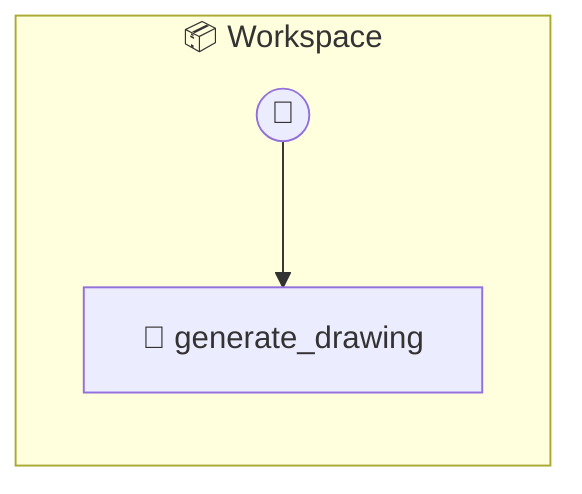

# Workspace

P2P Collaborative Workspace (with AI Assistant)

> **1 tools** · API Photon · v1.1.0 · MIT


## ⚙️ Configuration


| Variable | Required | Type | Description |
|----------|----------|------|-------------|
| `WORKSPACE_CLAUDE` | Yes | any | No description available |


## 🔧 Tools


### `generate_drawing`

Use AI to generate a diagram or sketch on the canvas.


| Parameter | Type | Required | Description |
|-----------|------|----------|-------------|
| `prompt` | string | Yes | Description of what to draw (e.g. "A sequence diagram for login") |


---


## 🏗️ Architecture




## 📥 Usage

```bash
# Install from marketplace
photon add workspace

# Get MCP config for your client
photon info workspace --mcp
```

## 📦 Dependencies

No external dependencies.

---

MIT · v1.1.0
